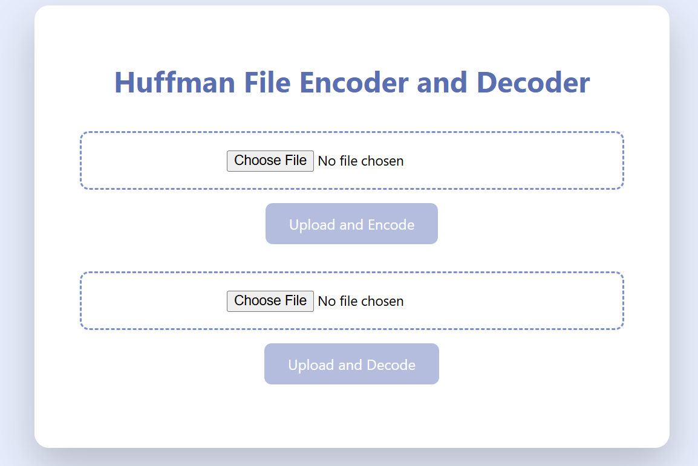
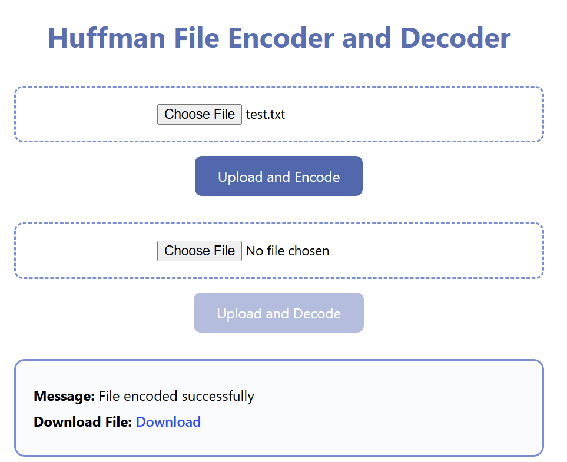
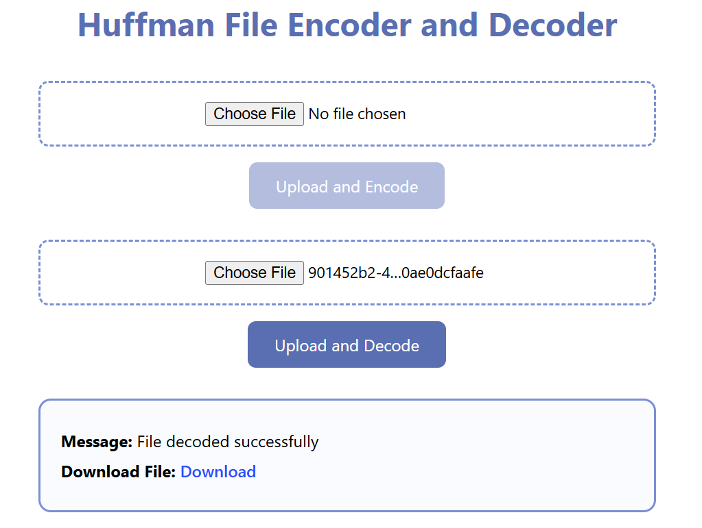
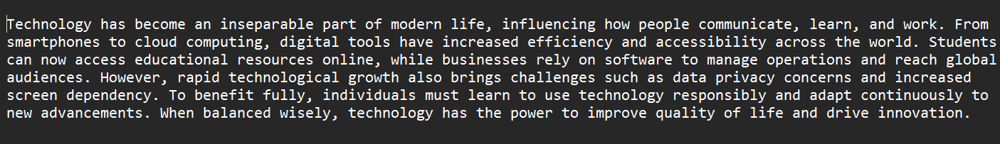

# Huffman File Compression Web Application

A full-stack web application that implements **Huffman coding** for lossless text file compression and decompression.  
The project integrates a **C++ compression engine** with a **Node.js/Express backend** and a **React frontend**, enabling efficient file processing through a web interface.

---

## 🚀 Features
- Lossless text file compression and decompression using Huffman coding
- Native C++ encoding and decoding engine
- Binary-safe file upload and download handling
- Supports large text files (up to ~100MB)
- Web-based user interface for easy file interaction
- Automated download of encoded and decoded files

---

## 🛠 Tech Stack
- **C++** – Huffman encoding and decoding engine
- **Node.js & Express** – Backend server and API handling
- **React** – Frontend user interface
- **Multer** – File upload handling
- **Axios** – Frontend–backend communication

---

## ▶️ How to Run the Project
1️⃣ Compile C++ Engine
```bash
cd cpp_engine
g++ huffman.cpp -o huffman
```
2️⃣ Start Backend Server

```bash
cd backend
npm install
node server.js
```
3️⃣ Start Frontend
```bash

cd frontend
npm install
npm run dev
```
## 📸 Application Screenshots

### 1️⃣ Backend Server Running


### 2️⃣ File Upload & Encoding Interface


### 3️⃣ Encoded File Output


### 4️⃣ File Upload & Decoding Interface


### 5️⃣ Decoded Text Output



